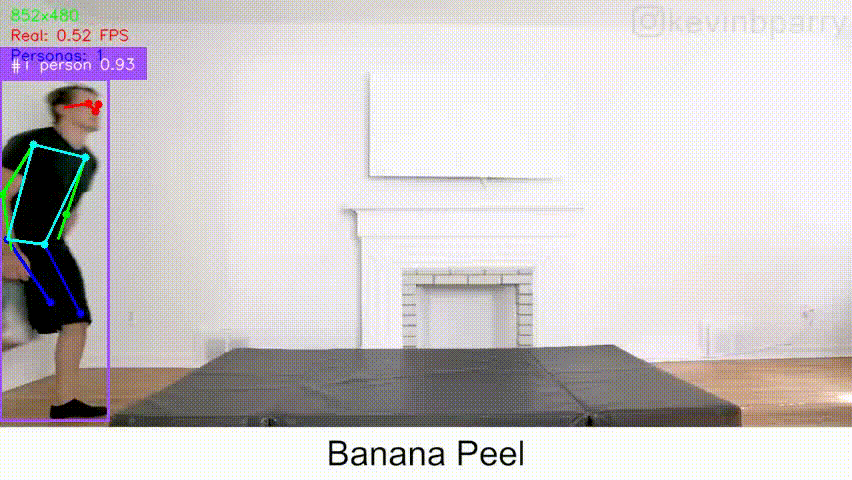

# Detección de Caídas mediante Estimación de Pose y GRU



## Descripción

Este proyecto implementa un sistema de detección de caídas utilizando técnicas de estimación de pose y redes neuronales recurrentes (GRU). El sistema es capaz de analizar secuencias de video para identificar caídas en tiempo real.

## Estructura del Proyecto

- `notebooks/`: Contiene notebooks de Jupyter para el entrenamiento y evaluación de modelos.
- `src/`: Contiene el código fuente del proyecto.
  - `models/`: Implementaciones de modelos de detección de caídas.
    - `fall_detection_lstm.py`: Modelo LSTM para detección de caídas.
    - `fall_detection_gru.py`: Modelo GRU para detección de caídas.
  - `utils/`: Utilidades y funciones auxiliares.
    - `video_detect_falls.py`: Funciones para la detección de caídas en videos.
    - `body.py`: Definiciones de conexiones y partes del cuerpo para la estimación de pose.
- `data/`: Directorio para almacenar datos de entrenamiento y prueba.
- `media/`: Contiene imágenes y videos utilizados en el README y otros documentos.

## Instalación

1. Clona el repositorio:
    ```bash
    git clone https://github.com/tu-usuario/fall-detection.git
    cd fall-detection
    ```

2. Crea un entorno virtual e instala las dependencias:
    ```bash
    python -m venv .venv
    source .venv/bin/activate  # En Windows: .venv\Scripts\activate
    pip install -r requirements.txt
    ```

## Uso

### Detección de Caídas en Video

Para detectar caídas en un video, utiliza el siguiente script:

```python
from src.utils.video_detect_falls import video_detect_falls

video_detect_falls(
    video_path='data/videos/test/falls/drunk.mp4',
    yolo_model_path='models/yolo11x-pose.pt',
    gru_model='models/fall_detector_gru.pth',
    fall_threshold=0.95,
    scale_percent=100,
    sequence_length=20,
    show_pose=True,
    record=True
)